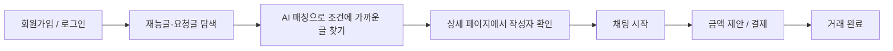
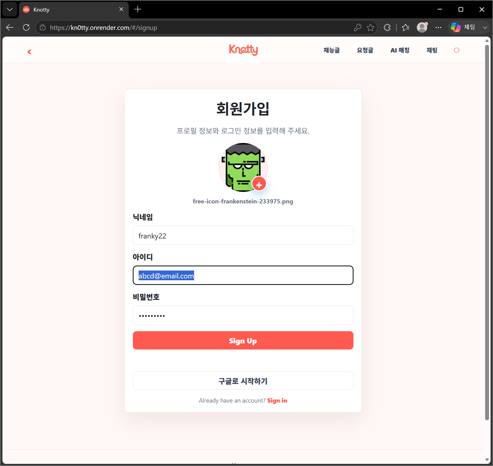
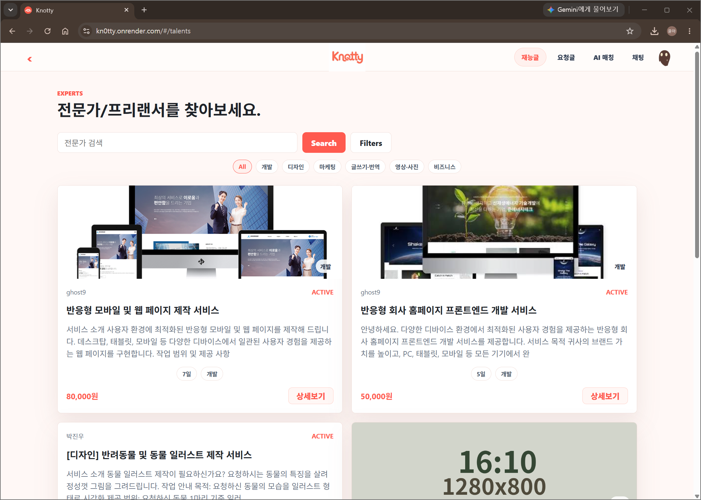
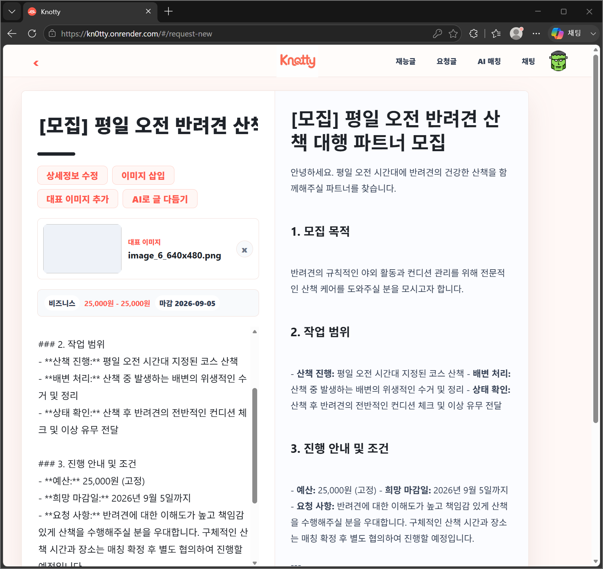
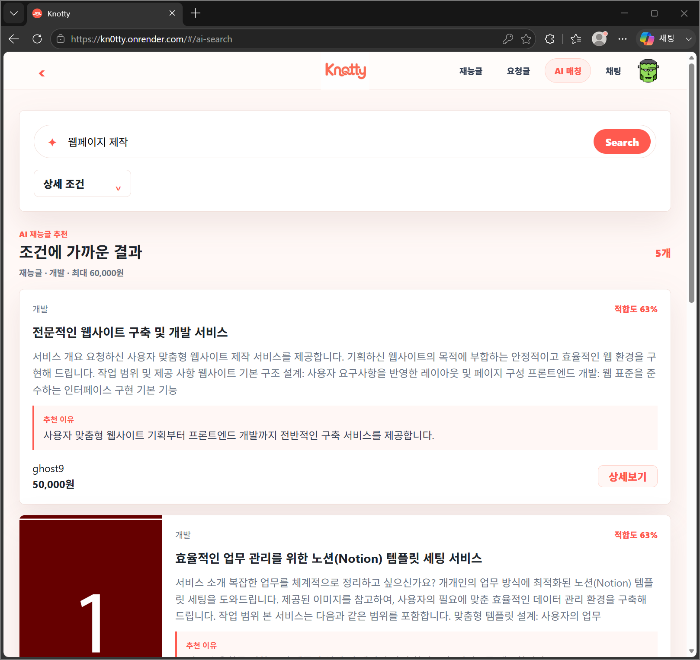
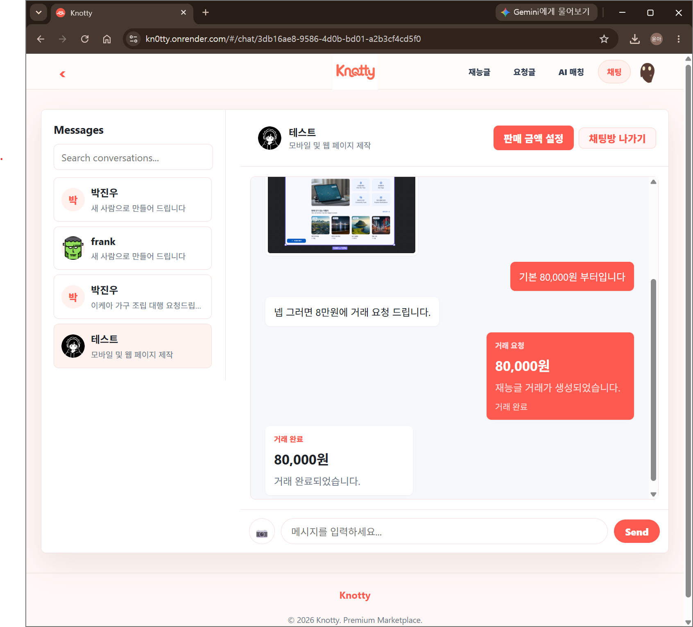
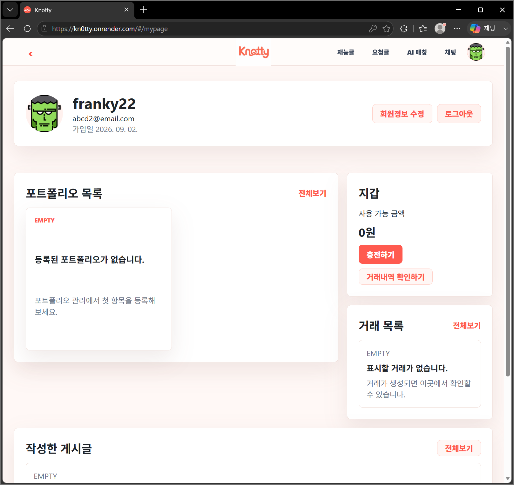

  

<h1 align="center">Knotty</h1>

  매듭 짓다, 더 가까워지다. 
  필요한 일과 가진 재능을 연결하는 재능 거래 플랫폼

  <table>
    <tr>
      <td align="center" width="160">
        <a href="https://github.com/wlsdn020416">
          
           
          
        </a>
      </td>
      <td align="center" width="160">
        <a href="https://github.com/pooreunblue">
          
           
          
        </a>
      </td>
      <td align="center" width="160">
        <a href="https://github.com/yeunyeuna">
          
           
          
        </a>
      </td>
    </tr>
  </table>

  <a href="https://kn0tty.onrender.com">서비스 바로가기</a>
  ·
  <a href="./docs/README.md">프로젝트 문서</a>
  ·
  <a href="./docs/specs/API-명세서.md">API 명세</a>
  ·
  <a href="./docs/database/ERD.md">ERD</a>

## 핵심 포인트

- 재능을 판매하는 사람과 필요한 일을 요청하는 사람을 연결하는 양방향 거래 구조
- 재능글·요청글·포트폴리오 기반 작성, 탐색, 채팅, 거래 흐름 제공
- HttpOnly Cookie, SameSite, CSRF Token, DOMPurify 기반 보안 적용
- 거래·지갑·요청글 상태 전이에 비관적 락과 DB 제약을 적용해 중복 결제 방지
- Spring AI, Gemini, pgvector를 활용한 자연어 기반 AI 매칭
- Render, Supabase Storage, PostgreSQL, Redis를 활용한 배포 환경 구성

## 유저 핵심 흐름

## Screenshots

<table>
  <tr>
    <td width="33.33%" align="center">
      
       
      <strong>회원가입</strong>
    </td>
    <td width="33.33%" align="center">
      
       
      <strong>재능글 목록</strong>
    </td>
    <td width="33.33%" align="center">
      
       
      <strong>AI 글 생성</strong>
    </td>
  </tr>
  <tr>
    <td width="33.33%" align="center">
      
       
      <strong>AI 매칭</strong>
    </td>
    <td width="33.33%" align="center">
      
       
      <strong>채팅 거래</strong>
    </td>
    <td width="33.33%" align="center">
      
       
      <strong>마이페이지</strong>
    </td>
  </tr>
</table>

## Tech Stack

### Backend

### Frontend

### Infra / External

## 상세 문서

| 문서 | 링크 |
| --- | --- |
| 전체 문서 안내 | [docs/README.md](./docs/README.md) |
| 시스템 아키텍처 | [docs/architecture/시스템-아키텍처.md](./docs/architecture/시스템-아키텍처.md) |
| 프로젝트 기획서 | [docs/specs/기획서.md](./docs/specs/기획서.md) |
| 요구사항 명세서 | [docs/specs/요구사항-명세서.md](./docs/specs/요구사항-명세서.md) |
| API 명세서 | [docs/specs/API-명세서.md](./docs/specs/API-명세서.md) |
| ERD | [docs/database/ERD.md](./docs/database/ERD.md) |
| Render 배포 가이드 | [docs/guides/Render-배포-가이드.md](./docs/guides/Render-배포-가이드.md) |
| AI 기능 개발 가이드 | [docs/ai/AI-기능-개발-가이드.md](./docs/ai/AI-기능-개발-가이드.md) |
| ADR | [docs/README.md#adr](./docs/README.md#adr) |
| 트러블슈팅 | [docs/README.md#트러블슈팅](./docs/README.md#트러블슈팅) |

## 실행

자세한 로컬 실행과 환경변수 설정은 [문서 전체 안내](./docs/README.md)와 [Render 배포 가이드](./docs/guides/Render-배포-가이드.md)를 참고한다.
