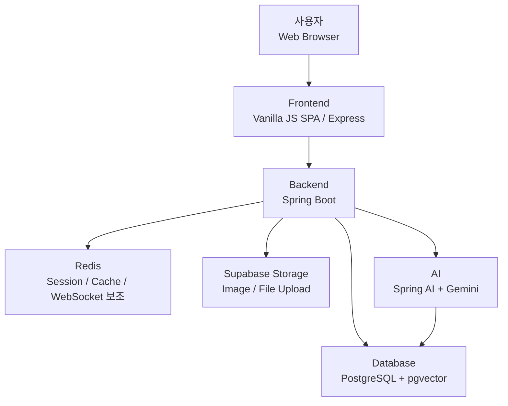

# 시스템 아키텍처

Knotty는 브라우저 기반 프론트엔드와 Spring Boot 백엔드를 중심으로, PostgreSQL, Redis, Supabase Storage, Spring AI + Gemini를 연동한다.

## 구성 요소

| 영역 | 역할 |
| --- | --- |
| Frontend | 화면 렌더링, 사용자 입력 처리, API 요청 프록시 |
| Backend | 인증, 게시글, 포트폴리오, 채팅, 거래, 지갑, AI API 처리 |
| Database | 서비스 핵심 데이터 저장, pgvector 기반 AI 검색 데이터 저장 |
| Redis | 인증·실시간 기능 보조 인프라 |
| Supabase Storage | 게시글, 포트폴리오 이미지와 파일 저장 |
| AI | Gemini 기반 글 생성, 임베딩, 매칭 추천 이유 생성 |

