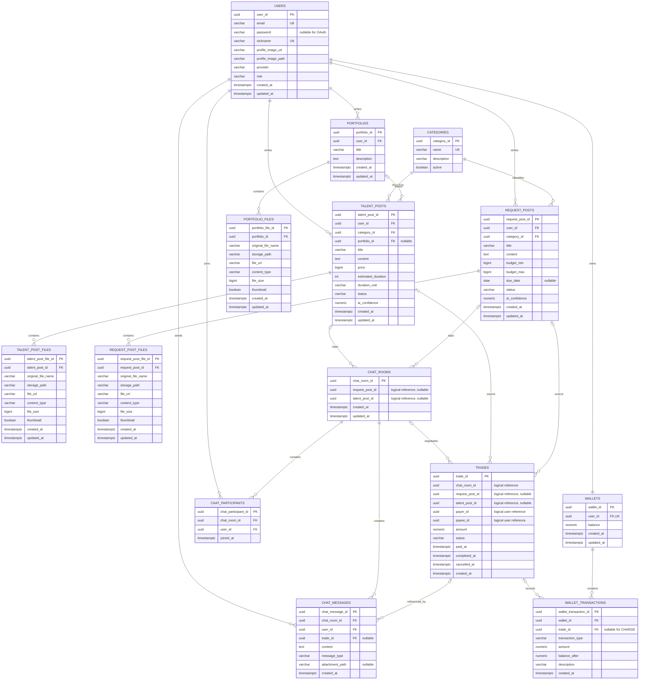

# ERD 및 데이터 모델

## 1. 기준

- 기준일: 2026년 9월 1일
- DBMS: PostgreSQL
- PK: 도메인 테이블 UUID
- VectorStore: Spring AI PgVectorStore, `id-type: TEXT`, dimension 1536
- Review/Reputation과 Bookmark 테이블은 MVP 범위에서 제외한다.

## 2. 관계도

`ChatRoom`과 `TradeEntity`의 게시글·사용자 ID 일부는 JPA 연관 객체가 아니라 UUID 값으로 관리한다. 위 관계도에는 도메인상 논리 관계를 표시했으며 실제 물리 FK 여부는 `schema.sql`을 기준으로 한다.

## 3. VectorStore

`vector_store`는 Spring AI가 관리하는 검색 전용 테이블이며 도메인 테이블의 source of truth가 아니다.

| 컬럼 | 타입 | 설명 |
| --- | --- | --- |
| `id` | TEXT PK | `{TARGET_TYPE}:{TARGET_UUID}` |
| `content` | TEXT | 제목·카테고리·의미 있는 본문 |
| `metadata` | JSON | `targetType`, `targetId`, `userId`, `categoryId`, `status` |
| `embedding` | VECTOR(1536) | Gemini `gemini-embedding-001` 결과 |

`targetId`를 이용해 원본 Talent/Request를 다시 조회하고, 상태·카테고리·금액·기간·마감 조건은 SQL 원본을 기준으로 검증한다.

## 4. 상태 및 enum

| 구분 | 값 |
| --- | --- |
| Talent status | `ACTIVE`, `INACTIVE` |
| Request status | `OPEN`, `IN_PROGRESS`, `CLOSED`, `CANCELLED` |
| Trade status | `PENDING`, `PAID`, `COMPLETED`, `CANCELLED` |
| Duration unit | `DAY`, `WEEK`, `MONTH` |
| Chat message type | `TEXT`, `IMAGE`, `SYSTEM`, `TRADE_REQUEST` |
| Wallet transaction type | `CHARGE`, `PAYMENT`, `RECEIVE`, `REFUND` |
| Embedding target type | `TALENT`, `REQUEST`, `PORTFOLIO` |

## 5. 정합성 제약

| 제약 | 목적 |
| --- | --- |
| `users.email`, `users.nickname` UNIQUE | 계정 중복 방지 |
| `(chat_room_id, user_id)` UNIQUE | 채팅방 참여자 중복 방지 |
| `wallets.user_id` UNIQUE | 사용자당 지갑 한 개 |
| 거래의 Request/Talent ID 중 정확히 하나만 존재 | 거래 원본 게시글 명확화 |
| 거래 금액 `> 0` | 잘못된 결제 금액 방지 |
| `payer_id <> payee_id` | 자기 자신과의 거래 방지 |
| 채팅방별 `PENDING`, `PAID` 거래 최대 한 건 | 진행 중 거래 중복 방지 |
| 요청글별 `PAID`, `COMPLETED` 거래 최대 한 건 | 1회성 요청글 중복 결제 방지 |
| `(trade_id, transaction_type)` UNIQUE | 중복 결제·정산·환불 내역 방지 |

애플리케이션에서는 거래, 요청글, 채팅방과 지갑 변경 경로에 `PESSIMISTIC_WRITE`를 적용해 경쟁 요청을 순차 처리한다.

## 6. 운영 DB 주의사항

- 신규 DB는 `docs/database/schema.sql`을 기준으로 생성한다.
- 기존 DB에서 UUID 이전 또는 `vector_store.id` 타입 변경을 이미 적용했다면 같은 마이그레이션을 반복 적용하지 않는다.
- `vector_store`는 검색 캐시 성격의 테이블이며 원본 게시글 데이터가 아니다. 모델, 차원 또는 Document text 규칙이 바뀌면 재임베딩이 필요하다.
